# Foxhole Storage Scanner (RUS)

Модифицированная русскоязычная версия комплексного программного обеспечения для автоматизированного извлечения, обработки и структурирования данных о запасах материально-технического снабжения (складов) в игре Foxhole. Данный проект построен на базе архитектуры исходного репозитория `xurxogr/foxhole-stockpiles` и расширен модулем промежуточной трансляции для Discord.

---

## Методы сбора данных и техническое описание

Приложение предоставляет единый интерфейс для агрегации данных, используя три независимых метода интеграции с игровым клиентом:

1. **Оптическое распознавание символов (OCR / Live Capture)**
   - **Принцип работы:** Программа перехватывает дескриптор активного окна игры по нажатию настраиваемой горячей клавиши (по умолчанию F9), выполняет захват графической области и передает изображение на внутренний аналитический движок. Также поддерживается ручная загрузка готовых файлов скриншотов.
   - **Алгоритм анализа:** Обработка выполняется специализированным движком `fs-ocr`, разработанным на языке Rust для обеспечения максимальной многопоточной производительности. Движок сопоставляет пиксельные матрицы элементов интерфейса со справочной базе шаблонов `data/fs_vanilla.h5`.
   - **Точность:** Согласно статистическим тестам на массиве из более чем 1000 сканирований, точность распознавания составляет 99.99% (4 пропущенных объекта из 27 538) при среднем уровень достоверности (confidence) 97.89%. Время обработки одного кадра на современных 6-ядерных процессорах составляет 1–2 секунды. Поддерживаются все стандартные разрешения экрана от 1280×1024 до 4K (3840×2160).

2. **Мониторинг буфера обмена (Clipboard Scanning)**
   - **Принцип работы:** Метод использует штатный внутриигровой функционал Foxhole. При нажатии пользователем кнопки "Copy to Clipboard" в интерфейсе склада, игра копирует текстовый лог запасов. Приложение, работая в фоновом режиме, мгновенно перехватывает событие изменения системного буфера обмена.
   - **Алгоритм анализа:** Полученные данные парсятся на основе внутренней структуры идентификаторов предметов, зафиксированных в локальном каталоге `data/catalog.json`. Это исключает вероятность ошибок распознавания, так как считываются прямые текстовые маркеры клиента.

3. **Прямой парсинг файлов сохранений (SAV Parsing)**
   - **Принцип работы:** Метод извлекает информацию напрямую из локальных файлов сохранений мировых данных клиента Foxhole.
   - **Алгоритм анализа:** Программа выполняет чтение и бинарный парсинг файла `MapData.sav` с помощью специализированного парсера `fs-sav`. Метод обрабатывает исключительно те склады и контейнеры, которые пользователь предварительно отметил как закрепленные ("pinned") на своей внутриигровой карте. Доступен режим циклического мониторинга (файловый вотчдог), запускающий повторный анализ автоматически при каждом обновлении файла операционной системой.

---

## Архитектура вывода данных и модуль трансляции (relay.py)

В оригинальной архитектуре результаты сканирования могут направляться в стандартный вывод консоли, записываться в локальные файлы (JSON, CSV, TSV) или транслироваться по протоколу HTTP POST на внешние вебхуки (например, напрямую в Discord). 

Однако прямой экспорт webhook-обработчика fs.exe отправляет сырой текстовый JSON-пакет, непригодный для оперативного чтения игроками в интерфейсе Discord. Для решения этой задачи структура проекта была модифицирована внедрением локального реле-сервера:

```mermaid
graph TD
    A[Игровой клиент Foxhole] -->|OCR / Буфер / SAV| B(fs.exe Сканер)
    B -->|Сырой JSON POST на localhost| C(relay.py Flask-сервер)
    C --> D[Парсинг item_codes.py]
    C -->|Рендеринг Pillow с графикой из Icons Foxhole| E[Итоговое изображение-таблица]
    E -->|Формирование Discord Embed| F[Discord Webhook]

    style A fill:#1f232a,stroke:#388bfd,stroke-width:2px
    style B fill:#1f232a,stroke:#388bfd,stroke-width:2px
    style C fill:#1f232a,stroke:#238636,stroke-width:2px
    style E fill:#1f232a,stroke:#8957e5,stroke-width:2px
    style F fill:#1f232a,stroke:#da3633,stroke-width:2px
```



### Компоненты локального сервера:
- **`relay.py`** — легковесный веб-сервер на базе микрофреймворка Flask. Принимает JSON от сканера, координирует генерацию графических таблиц посредством библиотеки Pillow и упаковывает результат в структурированные Embed-сообщения со встроенными медиа-вложениями.
- **`item_codes.py`** — словарь-дескриптор, содержащий жесткие связи между официальными системными кодами предметов Foxhole и русскоязычной локализации названий.
- **`Icons Foxhole`** — локальная база графических ассетов (кастомных иконок предметов), используемая Pillow для сборки финальной визуальной таблицы перед отправкой в вебхук.

---

## Полная структура репозитория

```text
💾 foxhole-stockpiles-main/
 ├── 📂 ChatExportforDEV/              # Логи чатов и файлы истории для разработки
 │    ├── 📄 CHANGELOG_foxhole_stockpiles.txt
 │    ├── 📄 chat_export_changelog4.txt
 │    └── 📄 Csession_changelog54.txt
 ├── 📂 data/                          # Обязательные базы данных приложения
 │    ├── 📄 catalog.json              # Каталог предметов для работы Clipboard
 │    └── 📄 fs_vanilla.h5             # База шаблонов иконок для работы OCR
 ├── 📂 docs/                          # Техническая документация проекта
 │    ├── 📂 CODEMAPS/                 # Карты архитектуры исходного кода (backend, data)
 │    ├── 📂 examples/                 # Примеры минимальных и production конфигов
 │    ├── 📄 advanced.md               # Продвинутая инструкция по CLI и сборке
 │    ├── 📄 configuration.md          # Спецификация конфигурационных файлов
 │    ├── 📄 troubleshooting.md        # Руководство по устранению ошибок
 │    └── 📄 webhooks.md               # Спецификация сетевых вебхуков
 ├── 📂 foxhole_stockpiles/            # Ядро рантайма (CLI, GUI, Сервисы, Модели)
 ├── 📂 fs_tools/                      # Набор утилит для разработчиков (fs-tools)
 ├── 📂 Icons Foxhole/                 # Пользовательская база вырезанных иконок предметов
 ├── 📂 scr/                           # Служебная графика и фоны для генератора таблиц
 ├── 📂 stubs/                         # Файлы-заглушки для статического анализа типов
 ├── 📂 tests/                         # Набор автоматических юнит-тестов всех систем
 ├── 📂 tools/                         # Скрипты калибровки оверлеев и синхронизации переводов
 ├── 📂 __pycache__/                   # Кэш компиляции байт-кода Python
 ├── 📄 .dockerignore                  # Список исключений для сборки контейнеров
 ├── 📄 .fs_config.example             # Шаблон конфигурационного файла приложения
 ├── 📄 .gitattributes                 # Системные параметры атрибутов Git
 ├── 📄 .gitignore                     # Список файлов, игнорируемых Git при коммитах
 ├── 📄 .pre-commit-config.yaml        # Конфигурация хуков перед фиксацией кода
 ├── 📄 CHANGELOG.md                   # История изменений основного проекта
 ├── 📄 CONTRIBUTING.md                # Правила и руководства для контрибьюторов
 ├── 📄 Coord.txt                      # Технический лог координат оверлея
 ├── 📄 LICENSE                        # Текст официальной лицензии MIT
 ├── 📄 README.md                      # Настоящее руководство пользователя
 ├── 📄 build_fs.py                    # Скрипт сборщика проекта в исполняемые файлы
 ├── 📄 codecov.yml                    # Конфигурация выгрузки отчетов о покрытии тестами
 ├── 📄 docker-build.sh                # Bash-скрипт для сборки Docker-образов
 ├── 📄 fs.exe                         # Скомпилированный исполняемый файл сканера складов
 ├── 📄 generate_mapping.py            # Автоматический скрипт-генератор словарей кодов
 ├── 📄 item_codes.py                  # Главный рабочий словарь русскоязычной локализации кодов
 ├── 📄 item_codes.py.bak              # Резервная копия словаря локализации кодов
 ├── 📄 item_codes.rar                 # Архивный бэкап словаря локализации кодов
 ├── 📄 listofallfiles.txt             # Текстовый слепок структуры каталога проекта
 ├── 📄 pyproject.toml                 # Основной конфигурационный файл зависимостей Python
 ├── 📄 relay.py                       # Сервер-транслятор для генерации и отправки таблиц в Discord
 ├── 📄 requirements.txt               # Список внешних зависимостей Python для установки через pip
 └── 📄 unmapped_items.log             # Технический лог нераспознанных или пропущенных предметов
```
---

## Инструкция по развертыванию и запуску

1. Откройте командную строку Windows (cmd) в корневой папке проекта.
2. Инициализируйте переменную адреса целевого канала Discord в оперативной памяти сессии и запустите сервер-транслятор:
   ```cmd
   set DISCORD_WEBHOOK_URL="https://discord.com"
   python relay.py
   ```
   *Важно: Использование переменных окружения предотвращает случайную утечку приватных токенов авторизации в публичный репозиторий GitHub.*
3. Запустите основной клиент `fs.exe`.
4. В графическом интерфейсе перейдите по пути **Settings → General** и установите параметр языка на **Russian**.
5. В разделе **Настройки → Вывод (Output)** активируйте чекбокс **Webhook** и задайте адрес локального реле-сервера: `http://127.0.0`.
6. В разделе **Настройки → Вход (Input)** выполните конфигурацию параметров сканирования под ваши задачи.

---

## Переносимость

Все файловые пути внутренних указателей сервера-транслятора (включая `BACKGROUND_PATH` и `ICONS_DIR`) переведены на динамическое определение относительно исполняемого скрипта (`os.path.dirname(os.path.abspath(__file__))`). Локальную директорию проекта допускается переносить между физическими дисками компьютера без риска нарушения целостности структуры путей.

---

## Вопросы и устранение проблем (FAQ)

**В логе сервера появляется предупреждение "WARNING UNMAPPED_ITEM code=..." со значениями "name_missing=True" или "icon_missing=True". Что это означает?**
- **Решение:** Это штатное сообщение системы, указывающее на появление в игре нового предмета, которого еще нет в ваших базах. 
  - Если `name_missing=True`, значит, код предмета отсутствует в словаре локализации. Откройте файл `item_codes.py` и добавьте текстовую связь для этого кода (например: `'EmplacedHeavyArtilleryW': 'Стационарная тяжелая артиллерия'`).
  - Если `icon_missing=True`, это означает, что `relay.py` не смог найти графический файл для этого предмета. Вам необходимо вырезать новую иконку из игры, сохранить её в папку `Icons Foxhole` и привязать имя файла к коду предмета в словаре.
  - Сообщение `INFO Discord ответил: 200` подтверждает, что несмотря на предупреждение об отсутствующей иконке, текстовые данные были успешно обработаны, сформированы в пакет и приняты серверами Discord.

**Какие встроенные инструменты предусмотрены для диагностики ошибок и как ими пользоваться?**
- **Решение:** Проект включает три основных инструмента для локализации и исправления технических сбоев:
  1. **Файл `unmapped_items.log`** — автоматически создается в корневой директории. В него записываются все неизвестные кодовые имена предметов, пришедшие от сканера `fs.exe`, для которых не удалось построить маппинг локализации или найти изображение. Рекомендуется проверять этот файл после каждого обновления игрового клиента Foxhole.
  2. **Лог вывода командной строки (`cmd`)** — при активной сессии `relay.py` в реальном времени отображает HTTP-статусы ответов от API Discord (например, статус `200` означает успешную отправку, статус `400` — ошибку формата данных, статус `404` — неверный токен вебхука).
  3. **Скрипт `generate_mapping.py`** — техническая утилита, позволяющая сопоставить ваши файлы из папки `Icons Foxhole` со справочной базой данных `data/catalog.json` для автоматического восполнения пробелов в словаре `item_codes.py` без необходимости ручного ввода.

**В логе сканера все предметы отмечены как "icon_missing", хотя картинки есть в папке.**
- **Решение:** Проверьте пути внутри `relay.py`. Убедитесь, что там удален жестко прописанный устаревший сегмент `\Foxhole-Storage\`. Для предотвращения проблемы используйте динамический путь на основе `os.path.dirname(os.path.abspath(__file__))`, который автоматически подстраивается под текущее расположение папки.

**При попытке выполнить команду "pip install" возникает ошибка, что команда не найдена.**
- **Решение:** Это означает, что интерпретатор Python либо отсутствует в системе, либо не был добавлен в системные переменные PATH. При переустановке Python обязательно активируйте чекбокс "Add python.exe to PATH" в нижней части стартового окна установщика. В качестве временного решения попробуйте использовать вызов встроенного лаунчера Windows: `py -m pip install -r requirements.txt`.

**Как безопасно обновить вебхук Дискорда, не рискуя слить приватный токен на GitHub?**
- **Решение:** Никогда не записывайте токен вебхука в текстовые файлы конфигурации внутри рабочей папки. Скрипт `relay.py` спроектирован так, что считывает секретный адрес напрямую из оперативной памяти процесса командной строки. Передавайте его только через команду `set DISCORD_WEBHOOK_URL="адрес_ссылки"` непосредственно перед запуском сервера. При закрытии окна cmd токен бесследно стирается из памяти.

**Скрипт relay.py выдает предупреждение "DISCORD_WEBHOOK_URL не задан" и останавливает работу.**
- **Решение:** Вы забыли выполнить команду `set` в текущей консоли либо открыли новое окно cmd. Переменные окружения изолированы в рамках одного сеанса. Команду `set DISCORD_WEBHOOK_URL=...` необходимо вводить один раз при каждом открытии нового окна командной строки перед вызовом `python relay.py`.

---

## Лицензия и правовая информация

Программный код распространяется под лицензией MIT (см. файл LICENSE). 
Файлы базы данных, спецификации каталогов и шаблоны в папке `data/` содержат информацию, производную от бинарных ассетов Foxhole, которые являются интеллектуальной собственностью компании Siege Camp. Данные компоненты предоставляются исключительно в рамках некоммерческого использования по принципу Fair Use. Пользователь несет личную ответственность за соблюдение применимых условий пользовательского соглашения (ToS).
